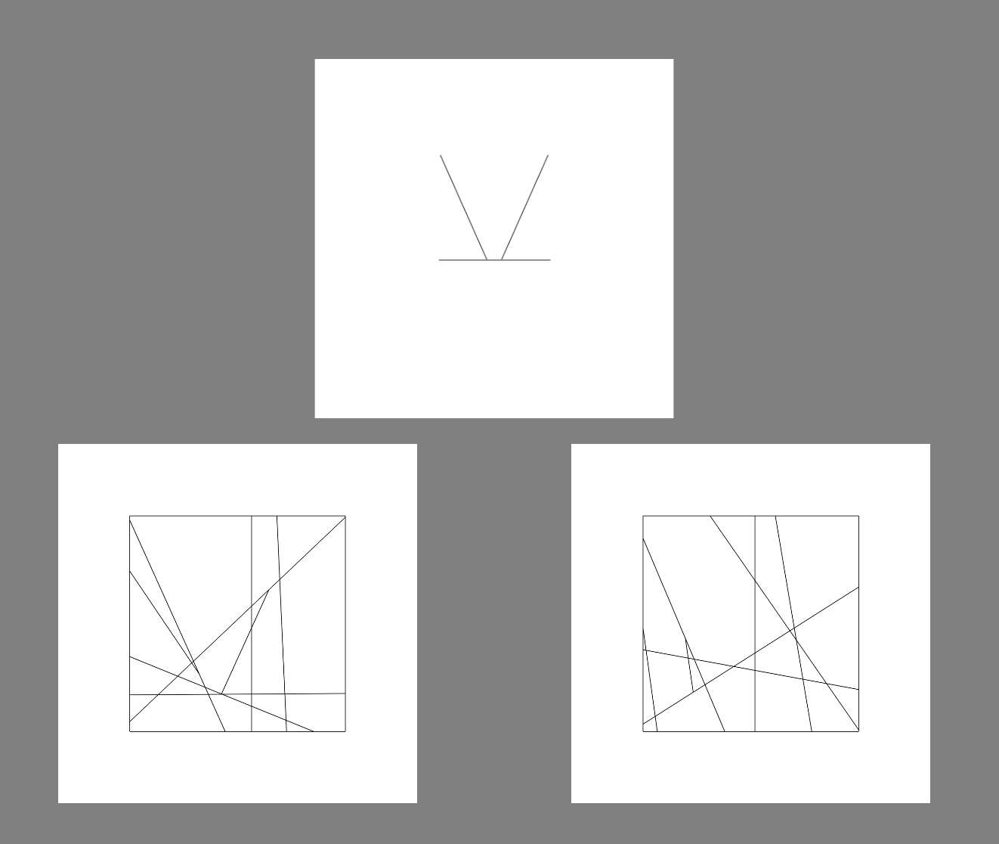
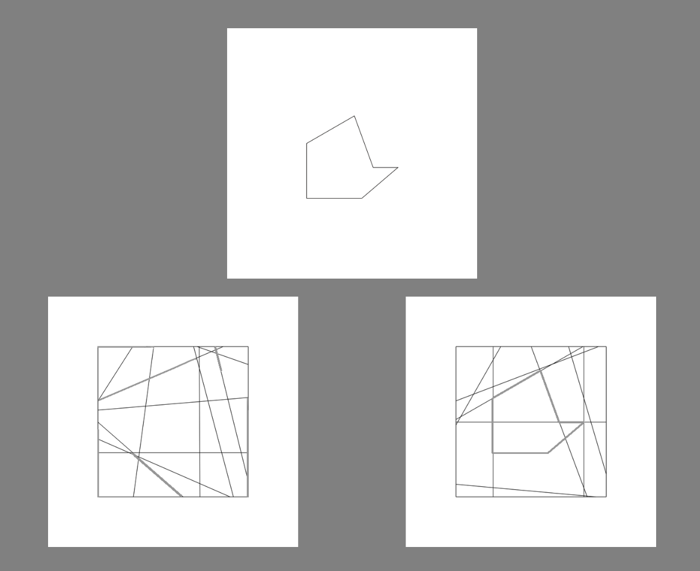

# Leuven Embedded Figures Test (L-EFT) in PsychoPy





This is a PsychoPy implementation of a variant of the [Leuven Embedded Figures Test (L-EFT)](https://peerj.com/articles/2862/), with Swedish instructions. This L-EFT variant involves 96 trials, with each trial presenting:
* a target object image at the top of the screen
* two 'context' images at the bottom of the screen
The participant is to indicate, within a set duration, whether the target object is embedded in the left or right context image.

## Demo, in-scanner and outside-scanner projects
This project includes 3 PsychoPy projects:
* 'instruction-demo' holds an 'experiment' that is meant to be used for demonstrating the L-EFT task to participants, e.g. to prepare them for doing the test inside of an MR scanner.
    - This is a very minimal demo. No automated feedback is given to the participant; instead, it's expected that the tester will be discussing what is the correct/incorrect response with the participant before the participant actually presses a key/button to proceed.
    - Here, the keys '1', '3', 'left arrow' and 'right arrow' are used to respond.
* 'left-in-scanner' holds a L-EFT version that is meant to be used in a two-screen setup and with an MR scanner, where the participant is lying in the scanner with a response button pad.
    - Here, the experiment (after instructions finish) waits for a signal from the scanner, corresponding to pressing the '5' key.
    - The experiment expects the scanning room monitor to be configured (in e.g. Windows monitor settings) as the secondary screen.
    - It's assumed that the response button pad is configured so that pressing the 'left' button corresponds to hitting the '3' key on a keyboard, and the 'right' button corresponds to hitting the '1' key.
* 'left-outside-scanner' holds a L-EFT version that is meant to be run on a single-screen setup, where the participant is seated at the experiment computer.
    - Here, the keys 'left arrow' and 'right arrow' are used to proceed through the experiment.

Read below for information on how to update e.g. what keyboard keys correspond to response buttons or scanner signals.

## Running the experiment
1. Install [Standalone PsychoPy](https://www.psychopy.org/download.html).
2. Download this project, by either using the green 'code' button and selecting 'Download ZIP', or by using `git clone` if you know Git.
3. Open up e.g. 'left-in-scanner/left-in-scanner.psyexp' with PsychoPy.
4. Click the cogwheel ('Edit experiment settings') icon, go to the 'Screen' tab, and insert specifications appropriate for your monitor(s) (if you haven't already, you also need to do setup in Monitor Center - please see the [PsychoPy documentation](https://www.psychopy.org/)).
5. Click the Play ('Run experiment') icon.

It is likely that you will also need to change experiment configurations, e.g. what signal the 'left-in-scanner' version should be listening or the size of stimuli. Some configurations are made in the 'instructions_part_one' routine's 'code_setup' code component, while others are set directly through the various PsychoPy components that are used.

## Experiment flow
### Trials
The experiment consists of 96 trials. Some of these trials are 'control' trials, where the embedded target has been 'highlighted' with thicker lines, while others are 'test' trials, where no 'highlighting' is present and the participant must search for the target. The 96 trials include:
* 16 'test' trials using unrotated images from the original L-EFT
* 8 'test' trials using rotated images from the original L-EFT
* 8 'test' trials using unrotated novel (not in original L-EFT) images
* 16 'control' trials using unrotated images from the original L-EFT
* 16 'control' trials using rotated images from the original L-EFT
* 24 'control' trials using unrotated novel images
* 8 'control' trials using rotated novel images (same images as used for 'test' trials with unrotated novel images, only with added highlighting)

Each trial lasts for a minimum of 2s, and a maximum of 20s.

Within-block trial order is pseudo-randomized on a per-participant basis, with the following restrictions:
* Trials with the same target must be separated by at least one other trials
* Trials with the same number of target lines may occur a maximum of three times in a row
* Trials with the same difficulty level may occur a maximum of three times in a row
* Trials with symmetric targets may occur a maximum of three times in a row (same goes for asymmetric targets)
* Trials with open shape targets may occur a maximum of three times in a row (same goes for closed shape targets)
* There must be the same amount of trials with the correct response/context image being 'left' as there are trials with the correct response being 'right', on a per-stimulus category basis.
    - E.g. there must be as many trials with an 'easy' difficulty level where the correct response is 'left' as there are trials with an 'easy' difficulty level where the correct response is 'right'.

### Blocks
The inside-scanner version has 3 types of blocks:
* Test (no highlighting) blocks consisting of 4 trials/block
* Control (highlighting) blocks consisting of 8 trials/block
* Baseline blocks where a black cross is displayed for 20s/block
The outside-scanner version has only the first 2 types of blocks.

Each block is preceded by a brief (3s) message indicating what type of block is starting.

Trials are separated by a jittered inter-stimulus-interval with a per-block average duration of 1s, jittered with steps 0.8s, 0.9s, 1.0s, 1.1s, 1.2s.

Blocks are pseudo-randomized on a per-participant basis. All three block types must occur before any type is repeated, e.g. "T Cr Co Cr Co T T Co Cr..." (T: test, Co: Control, Cr: Cross).

Trial/block orders are determined by files in the 'trial_orders' directory (>700 such files are included in the repository). For each experiment run, one of these files is chosen to be used with a participant. After experiment completion, the file is deleted, to ensure that each file is only used once. It was requested by research leaders that this 'orders defined in files' approach be used, in order to avoid any potential issues with generating orders at the beginning of experiments. The script for generating these trial order files has unfortunately been lost, but it can be recreated by writing a script which generates trial orders while adhering to the restrictions described above.

## Translating the experiment
In PsychoPy, click the Text Components (e.g. in the routine 'instructions_part_one' there is a component 'text_instructions_part_one'). In the window that pops up, edit the 'Text' field. It's recommended that you copy and paste the Swedish text snippets into e.g. Google Translate as a start.

Additionally, you need to:
1. Open 'left-in-scanner.psyexp'.
2. Go to 'instructions_part_one'.
3. Open up the 'code' component.
4. In the 'Before experiment' tab, scroll down to where you find the following code and update it with your translations. (make sure to leave the apostrophes `''`).
```py
NOTFOUND_TXT = 'Formen fanns här. Tryck höger knapp.'
FOUND_TXT = 'Precis, formen fanns här. Tryck höger knapp.'
```

Once you've finished translating the experiment, save it ('Save current experiment file' in main window toolbar) and try running it again.

## Stimuli
The original L-EFT stimuli can be found on [figshare](https://figshare.com/articles/dataset/Leuven_Embedded_Figures_Test_Target_Shapes/3807885).

Stimuli are presented with width/height of 7° (degrees of visual angle), at a vertical offset from monitor center of 3.75°, and horizontal (for context images) offset of 5°. These settings can be changed in the 'code_setup' code component mentioned above.

In the 'control' trial context images, highlighted lines are colored with a light-grey color (RGB code `(150, 150, 150)`, corresponding hex code `#969696`).

Apart from stimuli used in the original L-EFT, this variant also includes some rotated stimuli and some 'novel' stimuli. The 'novel' images were produced with the [leftstim package](https://github.com/AnonZebra/leftstim).

Note that this variant of the L-EFT only uses stimuli that are of the 'next highest' and 'highest' difficulty levels, as described in the [original L-EFT articles](https://peerj.com/articles/2862/). This was decided on since we wanted to make sure that participants wouldn't finish trials too quickly when running the experiment during brain scanning. This is also the reason for why novel stimuli were needed.

In the file 'left_context_characteristics.csv', all embedded context stimuli are described in greater detail. It includes the following columns:
* left_path: Describes the relative filepath to the context image (corresponds to 'left_image_path' in experiment output data, see below).
* block_type: Says what type of block ('control'/'test') the stimulus is used in.
* target_name: Specifies what target figure is used in the trial involving the context stimulus.
    - The names are based on the original L-EFT article - you can look in 'stimuli_left/targets' to see which figure is which, based on the filenames there.
* rotated: Specifies whether or not the target figure is rotated in the trials involving the context stimulus. 
* symmetrical: Specifies whether or not the target figure used in the trials involving the context stimulus is symmetrical or not.
    - Example: The likesided triangle figure, A1, is symmetrical, while the 'incomplete triangle' figure, D1, is not.
* hi_difficulty: Says whether the trial where the context image is used is of high difficulty (True - corresponds to 'highest difficulty level' in original L-EFT) or not (False - corresponds to 'next highest difficulty level' in original L-EFT).
* open: Specifies whether or not the target figure is 'open', meaning not all of the figure's line endings are linked to at least two lines, in the trials involving the context stimulus. 
    - Example: The likesided triangle figure, A1, is 'closed', while the 'jigsaw' figure, D2, is 'open'.

## Output data
The most relevant output data files are the 'CSV'/'.csv' files, saved to the 'data' directory. The most important columns in these files are as follows:

* left_image_path: Indicates what context image was shown on the left-hand side. 
    - The image shown on the right-hand side is easily deduced due to a simple naming convention for all image files. e.g. if the 'left_image_path' cell has value 'stimuli_left/contexts/test/054a.png', the right-hand side context image must have been 'stimuli_left/contexts/test/054b.png'.
    - All images are numbered in agreement with the numbering used for [the original L-EFT stimuli files on Figshare](https://figshare.com/articles/dataset/Leuven_Embedded_Figures_Test_Target_Shapes/3807885). e.g. context images numbered 12 through 15 are for trials where the target is an equilateral triangle, where the '12' images correspond to the lowest 'difficulty level', and the '15' images corresponding to the highest difficulty.
    - Context image filenames also have suffixes that indicated whether the image is novel (otherwise, it's from the original L-EFT stimuli) and/or rotated. e.g. if 'left_image_path' is 'stimuli_left/contexts/control/010b_novel_rotated.png', this means that the trial was a 'control' trial and had novel context images where the target had been rotated.
* key_resp_trial.corr: indicates whether participant response was 'correct', 'incorrect', or there was 'no response' (for 'baseline' blocks, this column holds a 'baseline' value).

Since the experiment output data are so sparse, you will likely want to combine output CSV files with the 'left_context_characteristics.csv' file (see the 'Stimuli' section above), to add e.g. information about what target was used for each trial. You can do this for instance in the programming/statistics language [R](https://www.r-project.org/) with commands similar to the following:

```r
# read in experiment data (update file path as necessary)
#df_expdata <- read.csv('left-in-scanner/data/id1_LeuvenEFT_2022_May_12_1432.csv')
df_expdata <- read.csv('left-in-scanner/data/sync15_1_LeuvenEFT_2021_Aug_23_0935.csv')
# keep only most relevant columns (update this as necessary)
df_expdata <- df_expdata[c("left_image_path", "key_resp_trial.corr")]
# read in context image characteristics data
df_contextdata <- read.csv('left_context_characteristics.csv')

# combine the experiment data with the context image characteristics data
# in a single data frame, simultaneously dropping all non-trial rows in
# the experiment data
df_exp_extended <- merge(
  x=df_expdata,
  y=df_contextdata,
  by.x='left_image_path',
  by.y='image_path'
)

# save as new CSV file (if you want - you might instead want to use
# the data frame directly in R, e.g. by combining multiple participants'
# trial data)
write.csv(df_exp_extended, 'my_participant_extended_data.csv')
```

## (not) Running the experiment online
This experiment was only developed for local use, i.e. not with online use in mind. Since it uses much custom Python code, it is unlikely that one could easily convert it to JavaScript for being run online. You are very welcome to try, but you might find it easier to rewrite the experiment from scratch.

## Attribution
The Leuven Embedded Figures Test was developed by Lee de-Wit​​, Hanne Huygelier​, Ruth Van der Hallen, Rebecca Chamberlain and Johan Wagemans. This PsychoPy implementation, and the new stimuli, were developed by Lowe Wilsson for a synesthesia research group at Karolinska Institutet, led by Janina Neufeld.

The original set of L-EFT stimuli as well as all material here are licensed under [CC BY 4.0](https://creativecommons.org/licenses/by/4.0/), meaning you are free to use and modify everything in this project, __provided that you include proper attribution__. You are required to cite this article:

> De-Wit, L., Huygelier, H., Van der Hallen, R., Chamberlain, R., & Wagemans, J. (2017). Developing the Leuven Embedded Figures Test (L-EFT): testing the stimulus features that influence embedding. PeerJ, 5, e2862.

Additionally, though it's not required you are very welcome to link to [this project's GitHub repository](https://github.com/anonzebra/left-psychopy) so that others can find it.
